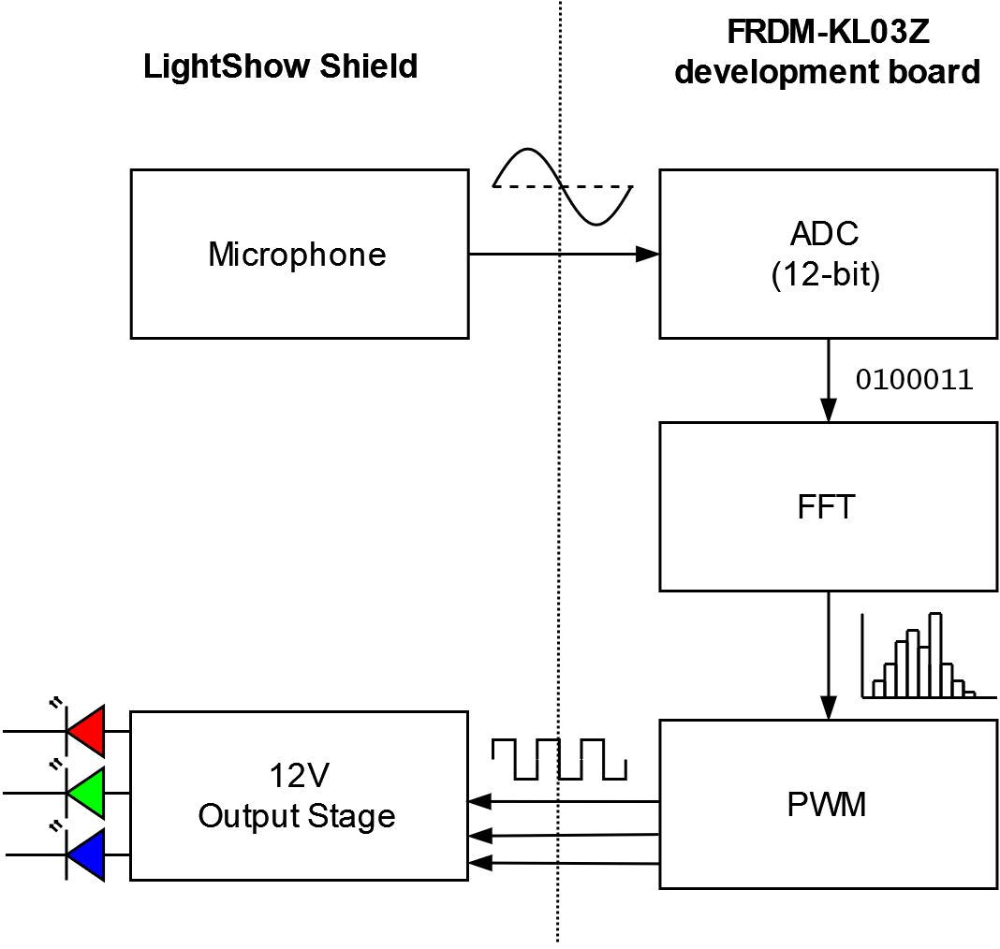

# LitShow Shield
Mikael Cognell - __mec77__ 

4B25: Coursework Item 5 

St Catharine's College 

_Demo video showing the lightshow in action, notice how the different colours respond to different sounds in the music and not simply volume (this is clearest with the second example)_

## System Overview
The LitShow shield runs on a Freescale/NXP FRDM KL03 evaluation board and  creates a real-time light show to music. The board uses a microphone to measure audio, analyses the signal on the MCU and outputs three channels of Pulse-Width Modulated 12V for LED strips. In the current firmware, the channels each respond to a different frequency band.

 

## LitShow Shield

#### Microphone
The shield provides two connectors for microphones and expects a 0-3.3V(max) pre-amplied signal with a DC offset at 1/2 VCC (DC offset is adjustable in software). The 3-pin connector matches the pinout of many commonly available electret microphone breakout boards - such as the [adafruit MAX4477](https://www.adafruit.com/product/1063). The 5-pin connector matches the pinout of the adafruit breakoutboard for the [MAX9814](https://www.adafruit.com/product/1713) with Automatic Gain Control.

The output from the microphone is interfaced to the MCU via a RC low-pass filter, with a -3dB frequncy of 20kHz. Furhter work on filtering could be useful, as the microphone still picks up some noise from the serial communication.
#### 12V Output Stage
Three NPN bipolar transistors ([BCP56T1G](https://www.onsemi.com/pdf/datasheet/bcp56t1-d.pdf)) in a common emitter configuration amplify the MCU PWM output. The 12V rail for the LEDs is supplied by an external power supply, connected via a barrel jack at the edge of the shield. MOSFETs would be better suited for this switching application - most enchancment mode NPN mosfets with the required current rating would make good replacements - but these were the only components I had on hand.

#### Hardware files
KiCad PCB project files are included in the repo. Note that they are designed for a single sided board, as I'm etching my PCB at home using a positive photoresist method. If ordering boards from a fab, it's worth considering rerouting the board to be double sided as certain headers (e.g. microphone header) currently have to be soldered on the wrong side and jumper resistors could be replaced by vias.

  
  

## FRDM-KL03Z Firmware
The shield connects to a Freescale/NXP FRDM KL03 evaluation board, which performs the signal processing of the audio and PWM generation. The software is based on the Warp-firmware, but most of the facilities have been removed and only the serial communication, clock & power management remain. 

The software is split into three components/source files:
#### [ADC.c](src\boot\ksdk1.1.0\ADC.c) - Analog to digtal conversion
The ADC is configured to sample the audio at 38kHz to fulfill the nyquist sampling criteria for the audible range. 
To ensure a constant delay between samples, the ADC operates in continuous conversion mode. 
At the completion of a conversion (i.e. a measurment), an interupt signal is generated and the <code>ADC0_IRQHandler()</code> ISR stores the latest sample in a buffer. 

Using interupts as opposed to e.g. a polling approach allows the main FFT algorithm to run while the next batch of samples are collected.
Also, instead of checking if the buffer is filled inside the interupt routine, the ADC is deactivated (by disconnecting it from its clock source) until the buffer is transfered into the FFT buffer.
This avoids interrupts firing when the buffer is already filled and we are waiting for the previous FFT to finish.

#### [FFT.c](src\boot\ksdk1.1.0\FFT.c) - Fast Fourier Transform
To extract frequency information, a discrete fourier transform is computed on the sample buffer using a costum implementation of a recursive Radix-2 FFT algorithm. The MKL03Z32VFK4 MCU is relatively constrained in memory, with only 2KB of SRAM. To minimize memory usage and increase performance the following design choices were made.

* **The FFT algorithm is implemented in-place** i.e. operates directly on the input array. This means the memory requirements scale as $O(n)$ as opposed to $O(n log(n) )$.

* **The [twiddle factors](https://en.wikipedia.org/wiki/Twiddle\_factor) are precomputed**. This avoids any computation of trigonometric quantities at run-time. Similarly (although much less critical), the bit reversal is also implemented using a look-up table instead of by bit operations. To generate the twiddle factors and bitReverse arrays, the python command line scripts <code> [twiddle_FPA.py](src\boot\ksdk1.1.0\FFT.c)</code> and <code> [bitReverse.py](src\boot\ksdk1.1.0\FFT.c)</code> are provided under <code>/pythonScripts</code>.

* **Divides and multiplications are implemented as shifts**.  As the MCU lacks a Floating Point Unit, the twiddle factors which lie between 1 and -1 are implemented using Fixed Point Arithmetic. A twiddle factor of 1 is represented by 32768 in the FPA arithmatic. After multiplying by the twiddle factors, the result needs to be normalized down again to prevent overflows. This is why 1 is mapped to a power of 2, so that the normalization can be achived by shifting rather than by division. From practical tests, a divide by e.g. 1000 on an <code>int32_t</code> is about 30 times slower than a right shift operation. After many trials using <code>memcpy()</code> to implement fast divisions of signed integers, I found out that the compiler automatically recognizes division by powers of two and implements them as shifts - even with signed numbers where the signbit needs to be considered.

* **Bit Reversal and FFT buffers never co-exist on the stack**. To minimize the peak demand on the stack, the sample re-ordering via bit-reversal which is required at the start of the FFT is executed before the complex array is placed on the stack. This way the two arrays never co-exist on the stack. The maximum demand comes from the complex array, which is $N \times 2 \times$ <code>sizeof(int16_t)</code> of memory on the stack (514 Bytes for 128 point FFT). Still, to accomodate the high memory demand, the default Warp linker script is modified to increase maximum size of the stack, and several modifications to the Warp firmware minimize the RAM usage (which leaves more space for the stack).

The FFT.c file also provides the helper routine <code>octaves()</code> for computing the power spectrum of the FFT and splitting it into octaves. An octave bin covers twice the width in frequency of the one below one - e.g. the 2 lowest FFT bins go in the lowest octave, the 4 next bins in the second octave, the 8 next go in the third octave etc. This is better aligned with the human logarithmic perception of frequency. These octaves are used by the PWM routines to determine brightness values.

#### [PWM.c](src\boot\ksdk1.1.0\PWM.c) - Mapping frequency information to duty cycles
The PWM.c functionality sets up the Timer modules of the MCU to output PWM signals on <code>PTA5</code>, <code>PTA6</code> and <code>PTB6</code>. It contains a function to update the duty cycles for each of the channels, which accepts as arguments a <code>pwmColour</code>struct which maps the respective colour to the corresponding timer instances and channels.

Each time an FFT completes in the main loop, the power spectrum is divided into three bins using the octaves function. The value of each bin then sets the duty cycle of a corresponding colour of LED. This means one LED channel responds to base tones, one to mid-range and one to trebble. There is a lot of scope for increasing the sophistication of the mapping from DFT to brightness values, as the current firmware basically only implements a low-pass, band-pass and high-pass filter (which could be done with 4 capacitors and 4 resistors...).

It also contains some functions to perform further processing of the frequency signals. For the base note, a first-order lag is applied to make the brightness linger more, as this produces a nice effect. 

#### printFFT - rudamentary spectrum analyzer ####
In [boot.c](src\boot\ksdk1.1.0\boot.c), the printFFT function can be uncommented to display power spectrum on a serial terminal connected to the FRDM-KL03Z. This works as a rudamentary spectrum analyzer, to partly validate the functioning of the FFT but also to characterize the response of the microphone of a reference sound source is available.